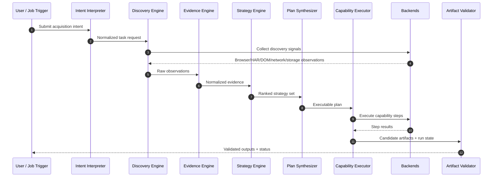
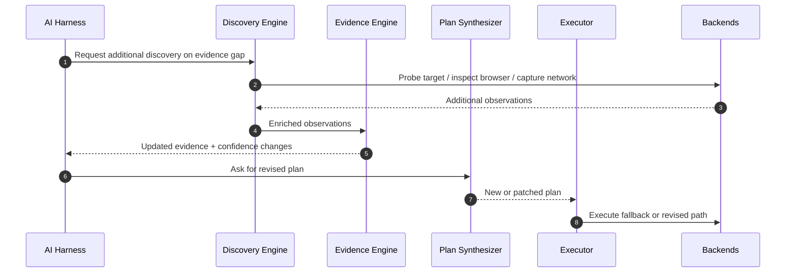

# Dynamic Acquisition Platform — System Design

**Status:** Draft v1  
**Language:** English only  
**Audience:** Staff+ engineers, platform engineers, workflow/agent engineers  
**Purpose:** Define the target architecture for a reusable dynamic acquisition platform that powers `consumer workflow`, `production workflow`, and future browser-assisted agent workflows.

---

# 1. Executive Summary

We are designing a **dynamic acquisition platform** rather than another site-specific scraper framework.

The platform must:
- inspect known and unknown targets
- discover the real acquisition surface behind websites and apps
- model evidence explicitly
- select strategies deliberately
- synthesize executable toolchains from reusable capabilities
- mix multiple backends in one run
- preserve deterministic output contracts for production workflows
- optionally allow an AI harness to intervene where dynamic judgment adds value

The final system is **not**:
- a bag of one-off provider scripts
- a browser-only automation engine
- a pure AI freeform agent loop
- a direct reimplementation of OpenCLI

The final system **is**:
- a contract-owned orchestration platform
- with composable capability primitives
- an evidence-first planning model
- mixed-backend execution
- optional AI-driven control and adaptation
- strict artifact, validation, and resume semantics

---

# 2. Problem Statement

Current browser/content automation work has reached three limits:

1. **Provider-centric scaling fails**  
   Adding a new site by writing another provider flow does not scale. The reuse unit is often not the whole provider flow, but the smaller capabilities hidden inside it.

2. **Static execution loses on unfamiliar targets**  
   Unknown or semi-known sites often require iterative discovery, pattern recognition, and mid-flight plan adaptation.

3. **Artifact-producing production systems need stronger guarantees**  
   `production workflow` and `consumer workflow` both require deterministic outputs, validation, resumability, and operational visibility. A pure CLI generation system is insufficient.

At the same time, OpenCLI research confirmed that a large part of the low-level discovery and command-surface overlap is real. Rebuilding that overlap blindly would be wasteful.

Therefore the design must:
- own higher-level contracts
- preserve freedom where it matters
- reuse overlapping backends where rational
- support both deterministic runs and optional AI-assisted exploration

---

# 3. Goals

## 3.1 Functional Goals

- Accept inputs such as:
  - URL
  - domain/site target
  - search objective
  - capture/export objective
  - recurring production workflow intent
- Discover acquisition surfaces using browser, network, storage, HAR, DOM, and target-specific signals
- Represent observed evidence in a normalized, reusable form
- Select and synthesize plans from reusable capabilities
- Support mixed-backend execution within one plan
- Support outputs including:
  - JSON
  - HTML
  - PDF
  - media assets
  - manifests
  - XLSX/tracker artifacts
  - run metadata
- Support resumable execution and validation
- Enable optional AI harness participation without making the system fully dependent on AI

## 3.2 Non-Functional Goals

- Composable
- Testable
- Replaceable by layer
- Operationally observable
- Incrementally adoptable
- Safe against backend lock-in
- Usable across multiple product flows

---

# 4. Non-Goals

This phase does **not** aim to:
- fully specify every low-level class or API signature
- replace every existing production flow immediately
- force all acquisition through AI harness mode
- fork or deeply embed OpenCLI internals
- define every site adapter in advance

This phase focuses on:
- platform shape
- module boundaries
- runtime contracts
- integration pattern
- planning model
- backend composition model

---

# 5. Design Principles

## 5.1 Own the Contracts
The platform must own its own:
- evidence schema
- capability catalog
- plan schema
- artifact contracts
- runtime state model
- validation semantics

No backend may become the source of truth for these contracts.

## 5.2 Capabilities First, Flows Second
The reusable unit is usually a **capability**, not a site-specific flow.

Examples:
- open browser tab
- inspect network
- extract storage
- normalize requests
- replay authenticated request
- render saved HTML to PDF
- package artifacts
- validate output bundle

## 5.3 Evidence Before Execution
The system should separate:
- observation
- interpretation
- strategy selection
- plan synthesis
- execution

This keeps planning explicit and makes AI intervention controllable.

## 5.4 Mixed Backend by Default
A run should not be forced into a single backend. A plan may combine:
- OpenCLI-backed discovery
- native render/PDF tooling
- native validators
- specialized provider backends
- future recording/replay engines

## 5.5 Deterministic Core, Optional AI Control
The platform must remain useful without AI harness mode. AI should enhance the system, not replace the deterministic core.

## 5.6 Thin Product Flows
Product-specific flows should orchestrate platform capabilities rather than reimplement the platform.

---

# 6. High-Level Architecture

## 6.1 System Context

```text
+--------------------------------------------------------------------------------+
|                               User / Trigger Sources                           |
|                                                                                |
|  Human requests | recurring jobs | product workflows | AI-directed work        |
+-------------------------------------------+------------------------------------+
                                            |
                                            v
+--------------------------------------------------------------------------------+
|                              Intent Interpretation Layer                       |
|                                                                                |
|  deterministic normalization | optional AI intent interpretation               |
+-------------------------------------------+------------------------------------+
                                            |
                                            v
+--------------------------------------------------------------------------------+
|                                 AI Harness Layer                               |
|                                                                                |
|  off | assist | explore | orchestrate                                          |
|  can inspect gaps, steer discovery, re-rank strategies, revise plans           |
+-------------------------------------------+------------------------------------+
                                            |
                                            v
+--------------------------------------------------------------------------------+
|                               Planning Core                                    |
|                                                                                |
|  discovery -> evidence -> strategy -> plan synthesis                           |
+-------------------------------------------+------------------------------------+
                                            |
                                            v
+--------------------------------------------------------------------------------+
|                             Capability Execution Layer                         |
|                                                                                |
|  capability facade | backend routing | retries | checkpoints                   |
+--------------------+------------------+-------------------+--------------------+
                     |                                      |
                     v                                      v
        +-----------------------------+        +-------------------------------+
        | OpenCLI-backed capabilities |        | Native / other backends       |
        | browser discovery           |        | render/pdf                    |
        | browser actions             |        | validators                    |
        | existing site commands      |        | manifests/run-meta            |
        | record/explore/generate     |        | specialized replay/download   |
        +-----------------------------+        +-------------------------------+
                                            |
                                            v
+--------------------------------------------------------------------------------+
|                         Artifact / State / Validation Layer                    |
|                                                                                |
| manifests | resume state | run-meta | bundles | contract validation            |
+-------------------------------------------+------------------------------------+
                                            |
                                            v
+--------------------------------------------------------------------------------+
|                                 Product Flows                                  |
|                                                                                |
| consumer workflow | production workflow | future acquisition products               |
+--------------------------------------------------------------------------------+
```

## 6.2 Architectural Style

This system uses a hybrid style:
- **Layered architecture** for conceptual separation
- **Ports and Adapters** for backend replaceability
- **Capability-oriented composition** for toolchain synthesis
- **Anti-corruption layers** for OpenCLI/backend isolation
- **Optional AI harness control plane** for adaptive orchestration

---

# 7. Architectural Decisions

## AD-1: The platform owns contracts
**Decision:** Define platform-native schemas for evidence, capabilities, plans, artifacts, and runtime state.

**Why:** Prevent backend-driven architecture drift and preserve long-term freedom.

## AD-2: OpenCLI is a backend, not the platform core
**Decision:** Use OpenCLI behind a wrapper when overlap is strong.

**Why:** Low-level overlap is real, but OpenCLI should not own our planning, artifacts, or orchestration semantics.

## AD-3: Backend choice is capability-level, not run-level
**Decision:** A single plan may use multiple backends.

**Why:** Different capabilities have different best implementations.

## AD-4: AI harness is optional but first-class
**Decision:** AI harness may participate in intent interpretation, discovery steering, evidence interpretation, strategy reprioritization, and re-planning.

**Why:** Static systems degrade badly on unfamiliar or changing targets; pure AI systems are too nondeterministic.

## AD-5: Product flows stay thin
**Decision:** `consumer workflow` and `production workflow` consume the platform rather than re-owning its internals.

**Why:** This keeps reuse high and migration incremental.

---

# 8. Core Domain Model

## 8.1 Intent Model
Represents what the caller wants, independently from execution.

Suggested fields:
- intent type
- target scope
- authentication expectations
- desired outputs
- confidence / ambiguity
- operational constraints
- user preferences

Examples:
- capture protected article as PDF + HTML + assets
- search multiple sites for topic X and summarize findings
- run recurring job hunt and emit tracker artifacts

## 8.2 Evidence Model
Represents observed facts and inferences.

Core sections:
- `entities`
- `observations`
- `requestFamilies`
- `authHints`
- `candidateFlows`
- `provenance`
- `confidence`

Examples of entities:
- site
- page
- document
- file
- lesson
- media asset
- export target
- account/session target

## 8.3 Capability Catalog
Represents reusable platform actions.

Each capability should define:
- stable capability ID
- input contract
- output contract
- eligible backends
- preferred backends
- side-effect profile
- preconditions
- checkpoint behavior
- validation hooks

## 8.4 Plan Model
Represents the synthesized toolchain.

Core sections:
- plan metadata
- selected strategy
- ordered steps
- step dependencies
- backend choice per step
- fallbacks
- checkpoints
- stop conditions
- validation rules

## 8.5 Artifact Contract
Represents required outputs and validation rules.

Examples:
- required files
- optional files
- schema constraints
- readability constraints
- size/non-empty constraints
- domain-specific validation

---

# 9. Module Architecture

## 9.1 Intent Interpreter

### Responsibility
Convert ambiguous user or job-level requests into a normalized platform intent.

### Submodules
- deterministic intent parser
- AI-assisted intent interpreter
- constraints extractor
- output contract initializer

### Notes
The output of this layer should be a stable task model, not freeform agent reasoning.

---

## 9.2 AI Harness

### Responsibility
Dynamically improve planning and execution without replacing deterministic platform contracts.

### Modes
- `off`: deterministic only
- `assist`: AI suggests but does not steer execution deeply
- `explore`: AI may request additional discovery and reprioritize plans
- `orchestrate`: AI may actively steer across layers under bounded control rules

### Allowed interventions
- enrich intent
- request more discovery steps
- classify likely patterns
- recommend strategy changes
- insert fallbacks
- revise plans after failures

### Not allowed to bypass
- artifact validation
- plan schema
- runtime state integrity
- backend safety policy

---

## 9.3 Discovery Engine

### Responsibility
Collect raw acquisition signals from the target.

### Inputs
- URLs
- browser state
- browser tabs
- DOM
- network events
- HAR files
- storage/cookies/headers
- backend-specific probes

### Outputs
- raw observations
- normalized observation records
- candidate entities
- evidence enrichments

### Discovery styles
- browser-first discovery
- HAR-first discovery
- API pattern probing
- storage/auth probing
- passive site command discovery from backends

---

## 9.4 Evidence Engine

### Responsibility
Transform observations into reusable, explainable evidence.

### Responsibilities include
- entity linking
- request family clustering
- auth hint normalization
- export signal detection
- evidence confidence scoring
- provenance retention

### Why it exists separately
This is the layer that lets planning reason about facts instead of raw logs.

---

## 9.5 Strategy Engine

### Responsibility
Choose the acquisition strategy family best suited to the current evidence.

### Example strategy families
- public fetch
- authenticated request replay
- storage-token replay
- browser render extract
- browser action export
- network intercept capture
- media stream capture
- paginated enumeration
- search-browse-extract

### Output
A ranked strategy set with reasons, preconditions, and fallbacks.

---

## 9.6 Plan Synthesizer

### Responsibility
Build an executable toolchain from intent, evidence, strategy, and available capabilities.

### Responsibilities include
- choose ordered steps
- assign backend per step
- attach checkpoints
- define fallback branches
- attach validators
- preserve explainability

### Key property
This module owns **toolchain composition**. Backends do not.

---

## 9.7 Capability Facade

### Responsibility
Expose stable platform-level operations to callers and the AI harness.

### Example platform capabilities
- `discover.target`
- `discover.browser.network`
- `discover.har`
- `evidence.normalize`
- `strategy.select`
- `plan.build`
- `plan.execute`
- `artifact.validate`
- `render.html_to_pdf`
- `bundle.media`

### Why it matters
This keeps callers insulated from backend-specific commands.

---

## 9.8 Backend Router

### Responsibility
Choose which backend fulfills a capability at execution time.

### Example backends
- OpenCLI backend
- native browser backend
- native render backend
- native packaging backend
- specialized replay backend
- future external tools

### Selection criteria
- capability support
- output compatibility
- stability
- control cost
- performance
- current runtime state

---

## 9.9 OpenCLI Adapter Layer

### Responsibility
Use OpenCLI where it overlaps strongly, without leaking OpenCLI concepts upward.

### Scope
- OpenCLI command invocation
- command output normalization
- error mapping
- capability availability mapping
- discovery command wrapping

### Explicitly avoided
- deep reliance on OpenCLI internal module APIs
- using OpenCLI registry as our capability catalog
- using OpenCLI runtime state as our source of truth

---

## 9.10 Native Execution Modules

### Responsibility
Own platform-critical capabilities that are too specific or too important to outsource.

### Example native modules
- render to PDF
- bundle HTML + assets
- manifest generation
- run-meta generation
- validation framework
- resume/checkpoint store
- business-specific artifact packaging

---

## 9.11 Artifact and Validation Runtime

### Responsibility
Turn execution results into production-safe outputs.

### Functions
- artifact contract enforcement
- bundle generation
- non-empty/readability checks
- schema validation
- run-meta persistence
- resume checkpoints
- domain-specific validators

This is a major differentiator from pure CLI generation systems.

---

## 9.12 Product Flow Layer

### Responsibility
Map product goals onto platform primitives.

### Example product flows
- protected article capture
- course lesson acquisition
- multi-site research collection
- daily career hunt

### Rule
Product flows orchestrate; they do not redefine discovery, evidence, or backend semantics.

---

# 10. Backend Strategy and Reuse Model

## 10.1 Why multiple backends are necessary
No single backend is optimal across:
- discovery
- browser actioning
- export retrieval
- rendering
- packaging
- validation

## 10.2 Backend ownership model

### Platform-owned
- contracts
- planning model
- runtime state
- artifact validation
- orchestration semantics

### Backend-owned
- specific implementation of selected capabilities

## 10.3 OpenCLI role
OpenCLI should be treated as:
- a strong command-oriented backend
- especially useful for browser discovery and existing site capabilities
- not the owner of planning or artifacts

---

# 11. Key Design Patterns

## 11.1 Ports and Adapters
Use for backend replaceability.

Examples of ports:
- discovery backend
- browser backend
- capability backend
- execution backend
- packaging backend

## 11.2 Anti-Corruption Layer
Use to isolate OpenCLI and other backends from platform-native contracts.

## 11.3 Strategy Pattern
Use inside the strategy engine for acquisition families.

## 11.4 Template Method / Plan Templates
Use for reusable plan skeletons such as:
- authenticated article capture
- browser export fallback
- list/detail enumeration
- render-and-bundle flow

## 11.5 Policy Objects
Use for backend selection, validation enforcement, and AI intervention rules.

## 11.6 State Machine
Use for plan lifecycle execution.

Example states:
- initialized
- discovering
- evidence_ready
- planning
- executing
- validating
- completed
- partial
- failed

---

# 12. Runtime Lifecycle

## 12.1 Primary Request Lifecycle

```text
1. Receive intent
2. Normalize intent
3. Optionally invoke AI harness for clarification
4. Run discovery steps
5. Normalize evidence
6. Select strategy set
7. Synthesize plan
8. Execute capability steps with backend routing
9. Validate artifacts
10. Persist outputs, run-meta, and checkpoints
11. Return final result
```

## 12.2 Failure and Re-planning Lifecycle

```text
1. Step fails
2. Capture structured failure
3. Update checkpoint
4. Determine whether fallback is deterministic or AI-assisted
5. Rebuild or revise plan
6. Resume from last valid checkpoint
7. Re-validate final outputs
```

---

# 13. Sequence Diagrams

## 13.1 Deterministic Acquisition Flow



## 13.2 AI-Assisted Re-Planning Flow



---

# 14. Logical Module Diagram

```text
+------------------------------------------------------------------------------------------------+
|                                      Dynamic Acquisition Platform                              |
+------------------------------------------------------------------------------------------------+
| Intent Layer                                                                                    |
|   - deterministic parser                                                                        |
|   - AI-assisted intent interpreter                                                              |
+------------------------------------------------------------------------------------------------+
| Control Layer                                                                                   |
|   - AI harness                                                                                  |
|   - intervention policy                                                                         |
+------------------------------------------------------------------------------------------------+
| Planning Core                                                                                   |
|   - discovery engine                                                                            |
|   - evidence engine                                                                             |
|   - strategy engine                                                                             |
|   - plan synthesizer                                                                            |
+------------------------------------------------------------------------------------------------+
| Execution Plane                                                                                 |
|   - capability facade                                                                           |
|   - backend router                                                                              |
|   - checkpoint manager                                                                          |
+------------------------------------------------------------------------------------------------+
| Backend Adapters                                                                                |
|   - opencli adapter                                                                             |
|   - native browser adapter                                                                      |
|   - native render adapter                                                                       |
|   - specialized replay/download adapters                                                        |
+------------------------------------------------------------------------------------------------+
| Artifact Runtime                                                                                |
|   - manifest builder                                                                            |
|   - run-meta writer                                                                             |
|   - validators                                                                                  |
|   - bundle packagers                                                                            |
+------------------------------------------------------------------------------------------------+
| Product Flows                                                                                   |
|   - content acquisition                                                                         |
|   - career agent                                                                                |
|   - future products                                                                             |
+------------------------------------------------------------------------------------------------+
```

---

# 15. Data and State Design

## 15.1 Core persisted objects
- intent snapshot
- evidence snapshot
- selected plan
- execution trace
- checkpoint state
- run-meta
- artifact manifest
- validator report

## 15.2 Why these are persisted separately
This enables:
- debugging
- resume after failure
- explainability
- AI-assisted re-planning without losing deterministic state
- product-specific reporting

---

# 16. Operational Model

## 16.1 Observability
Capture:
- discovery inputs and outputs
- evidence confidence changes
- chosen strategy and reason codes
- selected backend per capability
- plan revision history
- validation results
- partial completion state

## 16.2 Failure taxonomy
At minimum classify failures as:
- intent ambiguity
- discovery insufficiency
- auth unavailable
- backend unsupported
- execution step failure
- artifact contract failure
- validation failure
- external drift/site change

## 16.3 Resume model
A plan step should define whether it is:
- replayable
- resumable
- idempotent
- side-effecting

This determines safe restart behavior.

---

# 17. Security and Trust Boundaries

## 17.1 Backend isolation
Backends must not redefine platform contracts.

## 17.2 Credential handling
Reuse authenticated browser/session state where needed, but avoid exporting sensitive auth material unless explicitly required by a selected capability.

## 17.3 AI harness boundaries
AI may influence planning and execution routing, but must not bypass:
- contract enforcement
- validation requirements
- backend safety policy
- artifact completeness checks

---

# 18. Migration Plan

## Phase 1 — Contracts and Planning Core
Define:
- evidence schema
- capability catalog
- plan schema
- artifact contract model

## Phase 2 — OpenCLI Wrapper + Native Critical Modules
Implement:
- thin OpenCLI backend adapter
- native render/PDF/bundle/validation modules
- backend routing model

## Phase 3 — First Consumer Integration
Integrate one scenario from:
- `consumer workflow`
- `production workflow`

## Phase 4 — AI Harness Enablement
Add controlled AI harness modes and intervention points.

## Phase 5 — Progressive Migration
Migrate product flows step-by-step while preserving current production chains until parity is proven.

---

# 19. Why This Design Is the Right Compromise

This design avoids four bad outcomes at once:

1. **Not another provider jungle**  
   because it centers capabilities, evidence, and plans.

2. **Not a blind OpenCLI reimplementation**  
   because overlapping layers are wrapped where useful.

3. **Not backend lock-in**  
   because the platform owns contracts and mixes backends.

4. **Not an unbounded AI agent system**  
   because deterministic contracts still govern execution and outputs.

That balance is the key architectural choice.

---

# 20. Immediate Next Design Package

The next design package should specify, in detail:
- evidence schema
- capability catalog schema
- plan schema
- backend routing policy
- AI harness intervention contract
- OpenCLI wrapper mapping

This document intentionally stops one level above those detailed contracts.

---

# Appendix A — Recommended Companion Diagrams

This document should be paired with Excalidraw source files for:
1. High-level system architecture
2. Planning core and backend composition
3. Product flow integration map
4. Failure/re-planning loop

These diagrams are created separately so they remain editable and presentation-quality.
